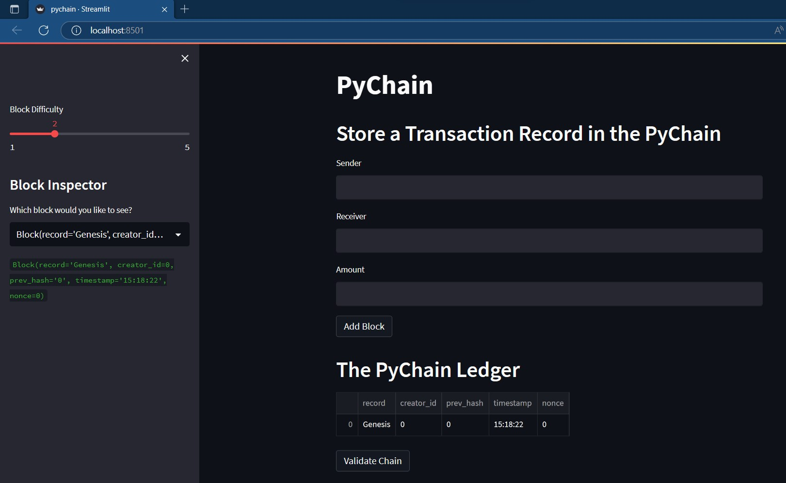
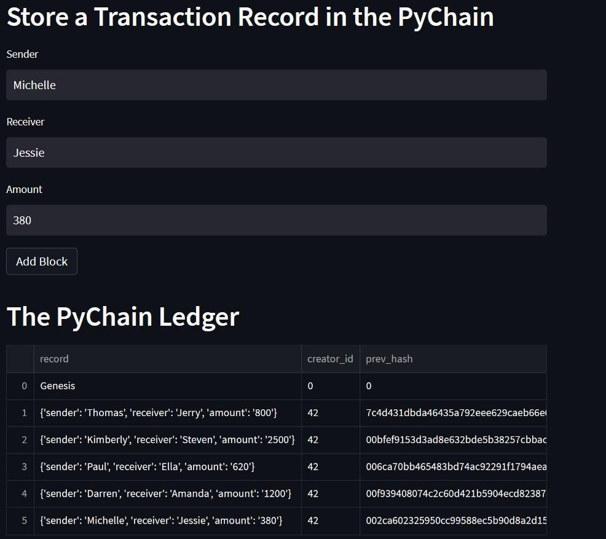
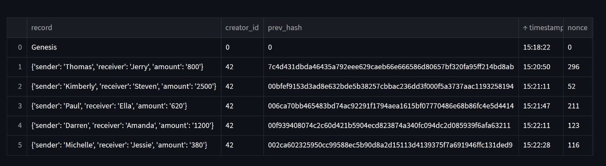
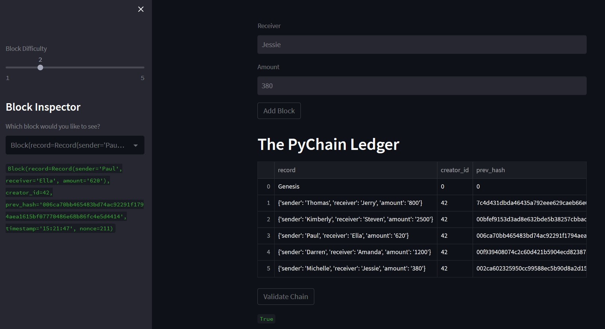
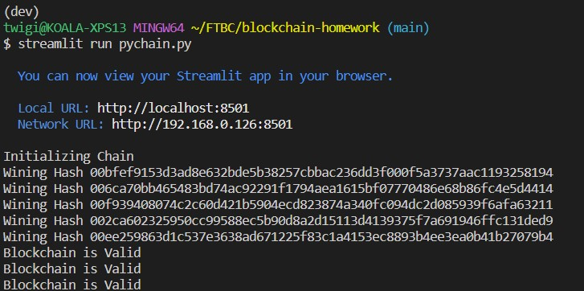

# Pychain Ledger

1. In the terminal, run the Streamlit application by using streamlit run pychain.py.  

The screenshot below shows the web interface.
  

2. Enter values for the sender, receiver, and amount, and then click the Add Block button. Do this several times to store several blocks in the ledger.  

The screenshot below shows how to enter a transaction record in the PyChain.   
Example: Michelle sent Jessie $380.00
  

Pychain ledger with five transaction records
  

3. Verify the block contents and hashes in the Streamlit dropdown menu. 

The screenshot below shows the validation of selected transaction: No2 - Kimberley sent Steven $2500.
  

4. Screenshot of terminal

  